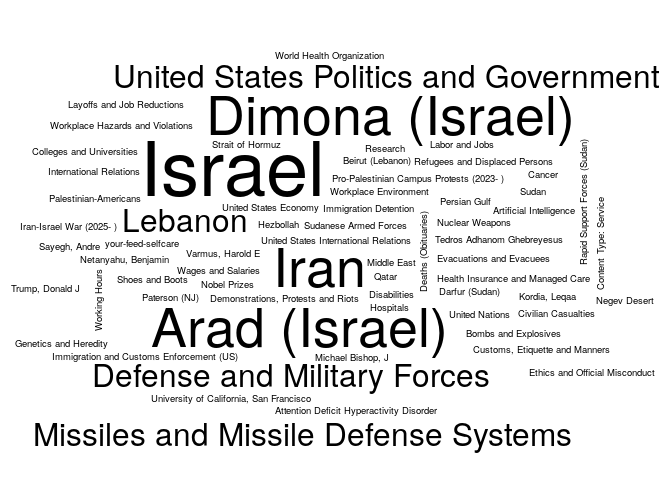

# NYTimes health news

The following is an example of how to use the [NYTimes
API](https://developer.nytimes.com/) to get a list of articles related
to a particular term. Here we are searching articles that include the
term `"health"`, and that were published up to seven days ago since
2023-03-13.

``` r
# Preparing a function to use the GET method with the NYTimes API
library(httr)
f <- function(offset = 0) {
  GET(
    url = "https://api.nytimes.com/",
    path = "svc/search/v2/articlesearch.json",
    query = list(
      fq           = "health",
      facet        = "true",
      "begin_date" = gsub("-", "", Sys.Date() - 7),
      "api-key"    = Sys.getenv("NYT_APIKEY"),
      offset       = offset
      )
    )
}

# Retrieving 40 articles
keywords <- NULL
maxtries <- 5
niters   <- 10
i        <- 1
ntries   <- 1
while ((ntries < maxtries) && (i <= niters)) {
  
  res <- tryCatch(f(10 * (i-1)), error = function(e) e)
  
  # If it returns error
  if (inherits(res, "error")) {
    ntries <- ntries + 1
    next
  }
  
  # If the return code is not 200
  if (httr::status_code(res) != 200) {
    ntries <- ntries + 1
    next
  }
  
  # Parsing the data
  ans <- httr::content(res)
  keywords <- c(
    keywords,
    sapply(ans$response$docs, function(x) sapply(x$keywords, "[[", "value"))
    )
  
  # Incrementing and restarting
  i      <- i + 1
  ntries <- 1L
  
}
```

Now that we got the data, we can proceed to do some visualization

``` r
library(ggplot2)
library(ggwordcloud)

keywords <- as.data.frame(table(unlist(keywords)))

# Just to make sure that we were able to download info!
stopifnot(nrow(keywords) > 1)
ggwordcloud(keywords[, 1], keywords[, 2])
```

<!-- -->

Finally, a table with the top 20 articles

``` r
tab <- keywords[order(-keywords[,2]),][1:20,]
colnames(tab) <- c("Keyword", "# Articles")
knitr::kable(tab, row.names = FALSE)
```

| Keyword                               | \# Articles |
|:--------------------------------------|------------:|
| United States Politics and Government |          40 |
| Republican Party                      |          30 |
| Abortion                              |          20 |
| Biden, Joseph R Jr                    |          20 |
| Coronavirus (2019-nCoV)               |          20 |
| Health Insurance and Managed Care     |          20 |
| Law and Legislation                   |          20 |
| Abbott, Gregory W (1957- )            |          10 |
| Adams, Eric L                         |          10 |
| AL QAEDA                              |          10 |
| al-Sharbi, Ghassan Abdullah           |          10 |
| American Civil Liberties Union        |          10 |
| Arrington, Jodey                      |          10 |
| audio-neutral-informative             |          10 |
| Automobiles                           |          10 |
| Bombs and Explosives                  |          10 |
| Coffeehouses                          |          10 |
| Defense Department                    |          10 |
| DeSantis, Ron                         |          10 |
| Detainees                             |          10 |
